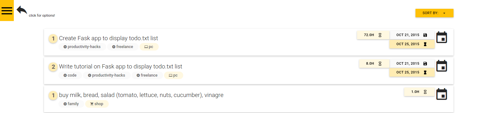

# A flask app to display Todo.txt 

I keep my todo list in a text file. This has numerous advantages like:

- future proof (Can be read in any operating system, yesterday, today and tomorrow)
- can be edited anywhere (phone, server, laptop, paper)
- independent of vendors / companies / databases which may or may not survive.
- fast to open / edit / save / load (online or offline)

Inspired by [todotxt.com](http://todotxt.com/), I have adopted [Gina Trapani's conventions](https://github.com/ginatrapani/todo.txt-cli/wiki/The-Todo.txt-Format):

- `(A)`, `(B)`, `(C)`, ...  encode priority
- `@pc`, `@smart`, `@t`, ... encode context (can it be done over the phone, on the pc, etc)
- `+finance`, `+freelancing`, ... encodes the project (what larger project is it part of?)
- `2015-10-03`, as a creation date
- `x `, to show the task is done

and added a few of my own:

- `[1yr]`, `[2mo]`, `[8w]`, `[4d]`, `[8h]`, `[20mn]`, to give a time estimate
- `due:2015-10-03`, for the due date

A text file, however makes it difficult to sort, organize, prioritize and extract statistics. So this web app addresses precisely that.  Once you have created a `todo.txt` and `done.txt`, you can run this Flask application, and explore your list:

This will let you:

- Sort by *Project*, *Context*, *Due Date*, *Time Estimate*, etc
- Explore some statistics (like how many 20 minute tasks are outstanding, how many tasks have been completed, etc)

# Installation instructions:

Dependencies:

- python 2.7
- pip

clone repo, create and activate a virtual environment, and install libraries:

    git clone git@github.com:alphydan/flask_todo.txt.git
    virtualenv virtual-td
    source virtual-td/bin/activate
    pip install -r requirements.txt

run:

    python todo.py

## Is it ready for production?

> No, no, hell no!  This software was built as a project to learn Flask, and to be used locally.  It has major security flaws and should not be deployed to production yet.

# Future fancy features to add to the todo:

- refactor code (merge filtering functions)
- Expand statistics
- prepare .css for pretty printing
- parse todo.txt list searching for formatting errors. For ex. [10m] instead of [10mo] or [10mn]
- add `JS` framework to interact from the web app
- Add Dropbox sync functionality
